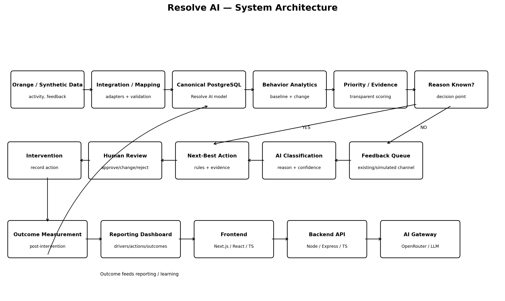

# System Architecture

## Flow
Data sources → Integration/Mapping → Canonical PostgreSQL Model → Behavior Analytics → Priority/Evidence → Feedback/AI Classification → Next-Best Action → Human Review → Intervention → Outcome → Reporting.

## Rule
The LLM is not the source of truth. Deterministic metrics remain in the backend, and high-impact decisions require human approval.
