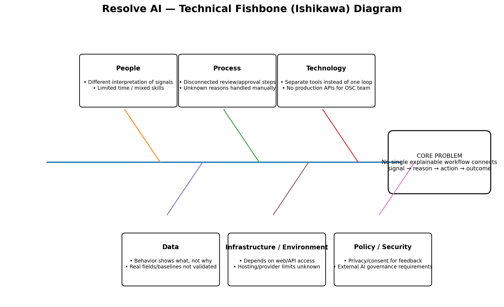

# Technical Fishbone Analysis

## Core Problem

Orange lacks one explainable technical workflow that connects customer disengagement signals to the reason, the right action, and the measured outcome.

## People

- Business users may interpret the same behavior signal differently.
- Limited time and mixed technical skills can slow consistent implementation.

## Process

- Signal review, feedback, action approval, and outcome tracking may occur as separate steps.
- Unknown reasons can lead to manual follow-up or inconsistent handling.

## Technology

- Existing tools and channels may perform separate functions instead of one complete decision loop.
- Production Orange APIs and integrations are not available to the OSC team.

## Data

- Behavioral data shows what changed but may not explain why.
- Real Orange data fields, baselines, completeness, and accessibility are not yet validated.

## Infrastructure / Environment

- The MVP depends on reliable web and API access for internal users.
- Hosting limits, AI-provider limits, and production-scale requirements are not yet confirmed.

## Policy / Security

- Customer feedback and transcripts may require privacy, consent, and retention controls.
- External AI services introduce data-minimization, access-control, and governance requirements.

## Root Technical Cause

The problem is not simply the absence of data or communication channels.

The technical root cause is the missing connection between:

**Signal → Evidence → Reason → Decision → Outcome**

## Diagram

