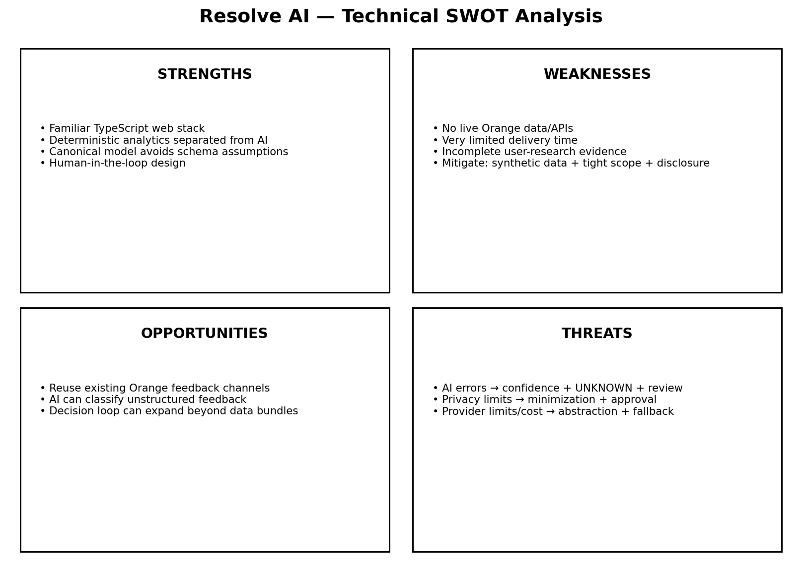

# Technical SWOT Analysis

## Strengths

- The team uses a familiar TypeScript-based web stack, reducing development time.
- Deterministic analytics are separated from AI, improving explainability.
- A canonical data model avoids assuming Orange's real production schema.
- Human-in-the-loop design reduces the risk of inappropriate autonomous actions.

## Weaknesses

### No live Orange production data or APIs
**Mitigation:** Use synthetic data and adapter interfaces while clearly identifying simulated integrations.

### Limited development time
**Mitigation:** Prioritize one complete end-to-end customer journey and freeze non-essential features.

### Incomplete user-research and usability evidence
**Mitigation:** Clearly disclose the limitation and treat personas and usability assumptions as provisional until validated.

## Opportunities

- Existing Orange feedback channels could provide richer evidence without requiring Resolve AI to build a new communication platform.
- AI can convert unstructured customer feedback into structured reason categories.
- The same decision-intelligence loop could later expand beyond data bundles if validated.

## Threats

### AI may misclassify customer feedback
**Mitigation:** Use confidence scores, a controlled taxonomy, an UNKNOWN state, and human review.

### Privacy or security requirements may restrict access to customer feedback
**Mitigation:** Minimize data usage, use synthetic data for the MVP, and require Orange approval before processing real customer information.

### Third-party AI or hosting providers may fail, change cost, or impose limits
**Mitigation:** Keep providers behind backend interfaces and implement retry and fallback mechanisms.

## Diagram

